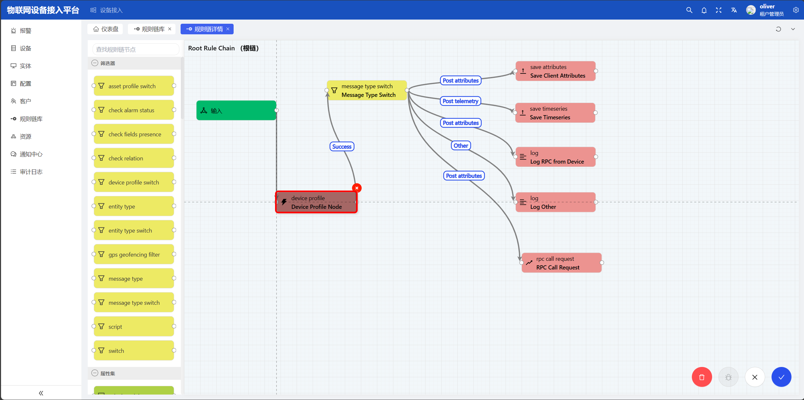
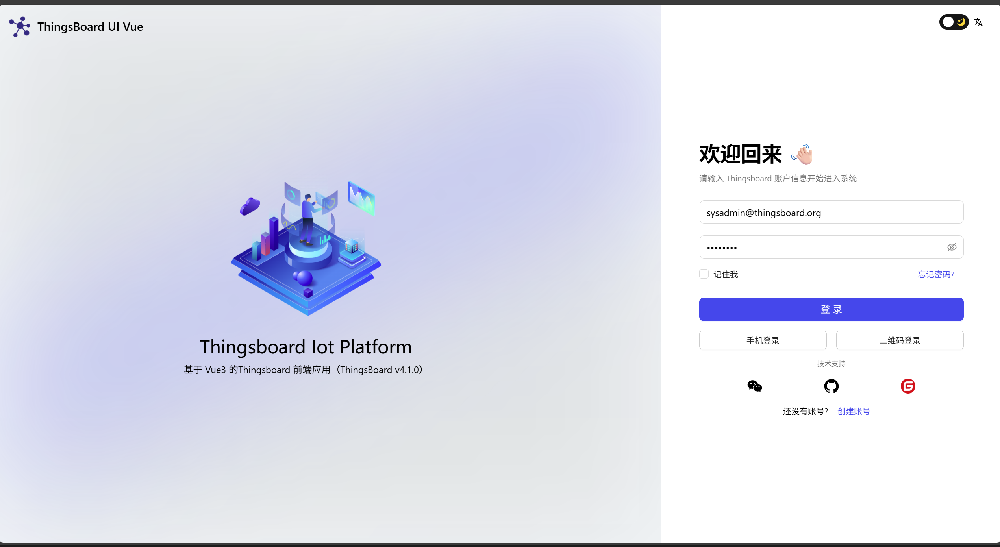

<div align="center">

  <br>
  <br>


  <h1>ThingsBoard UI Vue3</h1>
</div>

[Chinese version](./README.md) | [Backend connection](./docker/BACKEND_CONNECTION.md)

## Introduction

ThingsBoard UI Vue3 is a frontend adaptation for ThingsBoard. As a free and open-source frontend project, it is built with the latest mainstream technologies such as Vue 3, Vite, and TypeScript, and is based on [vue-vben-admin](https://github.com/vbenjs/vue-vben-admin). It works out of the box, suitable for replacing the default frontend, and is also great for learning and reference.

🎉 Please keep following the project — welcome to watch, star, and fork!

## Upgrade Notice

This is the latest version, compatible with ThingsBoard 4.1.0. It is not compatible with other versions. If you are starting a new project, it is recommended to use the latest version. If you want to view the 3.x version, please check the other branches.

## Features

- 📌 Rule Chain source code is fully open
- 📌 Thing Model completed
- 📌 Web visualization: in development...
- 📌 Big-screen dashboards: completed
- 📌 TDengine: adapted
- 📌 uni-app mini program: in development...
- 📌 Dashboards: in development...

## Preview URL

- ThingsBoard: http://thingsboard.yantsing.com/vue/
- Username: 1069035666@qq.com (my email)
- Password: 17621315188 (my WeChat, feel free to reach out and discuss)

## ThingsBoard

- ThingsBoard: V4.0.1, continuously updated

## Tech Stack

- [Vite](https://vitejs.dev/)
- [Vue v3](https://cn.vuejs.org/)
- [Vue Router v4](https://next.router.vuejs.org/)
- [JeeSite Vue3](https://gitee.com/thinkgem/jeesite-vue/)
- [Vue Vben Admin](https://jeesite.com/front/vben-admin/)
- [Ant Design Vue](https://antdv.com/components/overview-cn/)
- [AntV X6](https://x6.antv.antgroup.com/)

## Getting Started

- Open the `.env.development` file and update the backend API:
  ```bash
  # Proxy configuration. You can configure multiple entries. Do not wrap lines.
  # Format: [api root path, proxy target, keep host header]
  VITE_PROXY = [["/api","http://127.0.0.1:8080/api",false]]
  # API root path for direct access (if any)
  VITE_GLOB_API_URL =
  ```
- Run and build:
  ```bash
  # Install dependencies
  yarn install
  # Start in development
  yarn serve
  # Preview after building
  yarn preview
  # Build for production
  yarn build
  ```

## Rule Engine

- [AntV X6](https://x6.antv.antgroup.com/)



## Preview Images




## Contact Us

<left class='img'>
  
</left>
